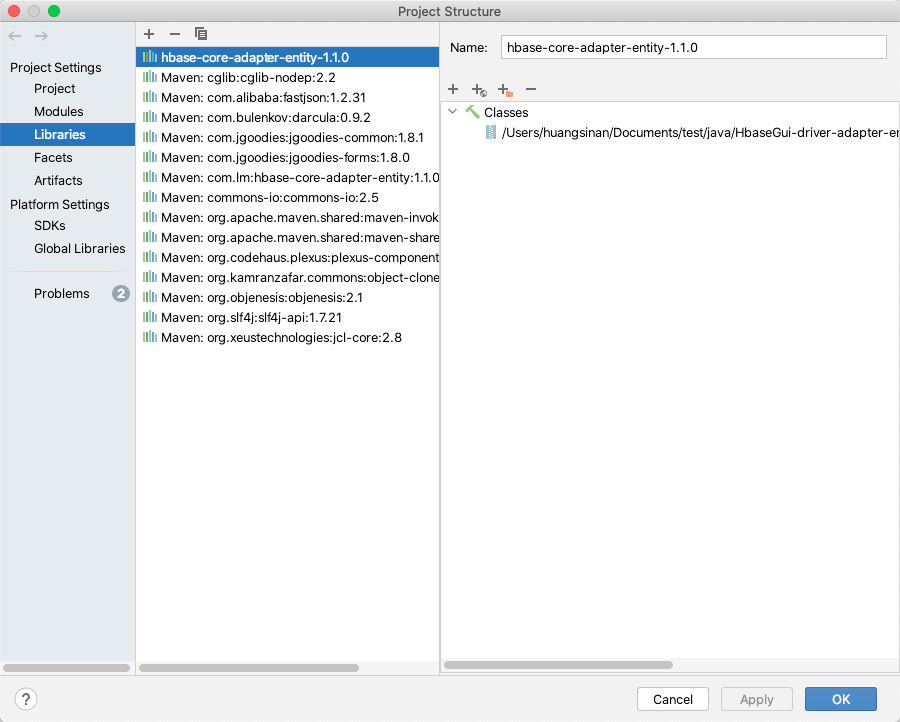

## 简介
Hbase GUI

这东西我是基于原项目自己小改了一波，适合给自己当工具用。原作者地址

This thing is based on the original project I own a small change wave, suitable for themselves as a tool. Original author address

[https://github.com/Observe-secretly/HbaseGUI](https://github.com/Observe-secretly/HbaseGUI)
## 特点
我基于原作者未开发的插入功能，手动改写并且重新编译1.3.2的adapter，实现了1.3.2版本hbase插入的功能
当然对于如果想直接插入bytes 还是不支持的。目前只支持1.3.2版本

I manually rewrote and recompiled the 1.3.2 adapter based on the original author's undeveloped insert function to achieve the 1.3.2 version of hbase insert function
Of course, if you want to insert bytes directly, it is still not supported。And this client is only support 1.3.2
  
## 使用
首先，你要手动指定hbase-core-adapter-entity，因为这里面包含了hbase client的 interface
所以我也改了一个传上来，就在software目录。

First, you have to specify hbase-core-adapter-entity manually, because it contains the hbase client interface
So I've also changed one and passed it on, in the software directory.




```shell
cd bin
sh start.sh
```